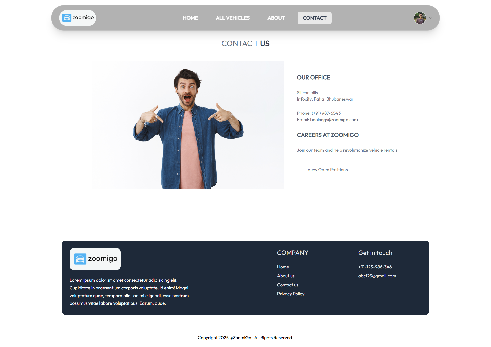
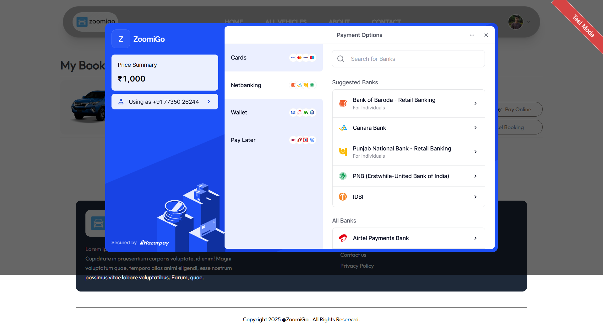
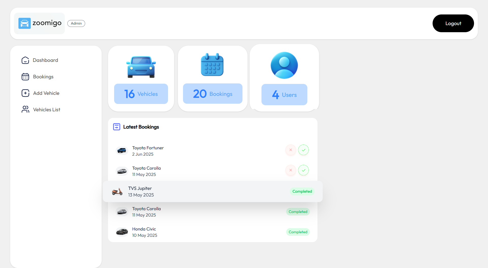
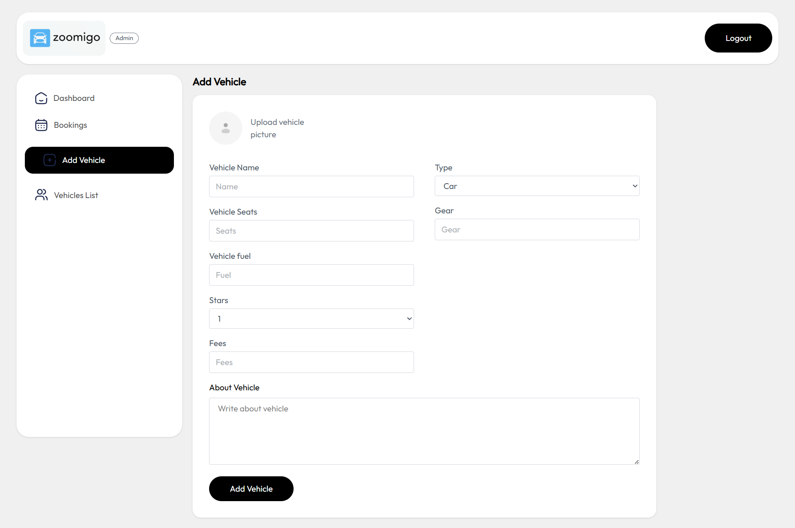

# ZoomiGo 🚗

ZoomiGo is a modern, real-time vehicle rental web application built with the MERN stack, offering seamless user experience, live vehicle availability, and secure online payments.

## 🚀 Tech Stack

- **Frontend:** React.js, Tailwind CSS, Framer Motion  
- **Backend:** Node.js, Express.js  
- **Database:** MongoDB  
- **Auth:** JWT, Role-Based Access Control  
- **Payments:** Razorpay API  
- **Media Handling:** Cloudinary  

## ✨ Features

- 🚘 Real-time vehicle availability and pricing for 400+ concurrent users
- 💳 Secure online payments via Razorpay with 15% higher booking completions and 3s faster processing
- 🎨 Smooth, modern UI powered by Framer Motion animations
- 📱 Fully responsive design for all devices
- 🛡️ JWT authentication and role-based access for secure access control
- ☁️ Image upload and management via Cloudinary

## 📷 Screenshots

- **Homepage**

- **All Vehicles**

- **About**

- **Contact**

- **Payment**

-  **Admin Dashboard**

- **Add Vehicle**

